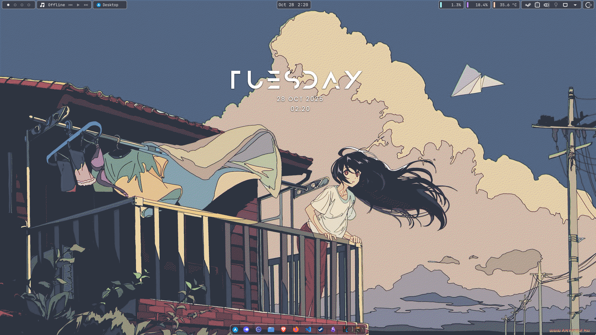
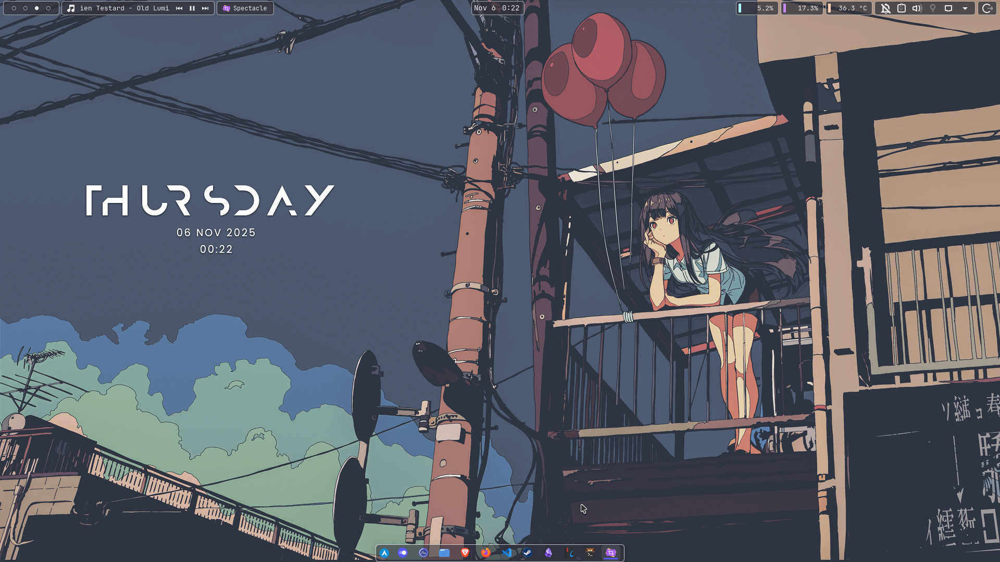
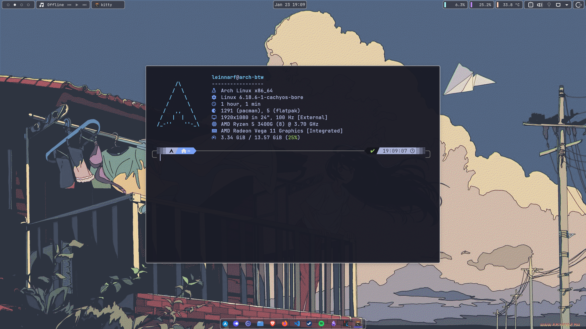

<h1 align=center>I use Arch btw</h1>

 

# Instructions
This is a personal repository containing my Arch Linux setup and configurations. Feel free to explore and use it as a reference for your own setup.

## Config Files
These are generally located in the `~/.config/` directory. You can copy them to your own system to replicate my setup.

### Zsh Config
My Zsh configuration file, `.zshrc`, is included here. You can place it in your home directory (`~/.zshrc`).

## KDE Setup
These are generally located in `~/.config` directory as well. For more specific instructions on setting up KDE, please refer to the [kde-config.md](kde-config.md) file in this repository.

## Obsidian Vault
My obsidian configurations, themes, and plugins. Place them in `.obsidian` of your Obsidian vault directory.

## VsCode Settings
My VSCode settings and extensions. Place them in the appropriate VSCode configuration directories.

They are generally located in:
- Settings: `~/.config/Code/User/settings.json`
- Keybindings: `~/.config/Code/User/keybindings.json`
- Profiles: `~/.config/Code/User/profiles.json`
- Snippets: `~/.config/Code/User/snippets/`

### Hsnips Snippets
My custom Hsnips snippets for VSCode is located in
`~/.config/Code/User/globalStorage/draivin.hsnips`

## Scripts
This repository also contains various scripts that I use for system maintenance and automation. You can find them in the `Scripts/` directory.

## Additional Notes
- Make sure to back up your existing configurations before replacing them with mine.
- Some configurations may require additional dependencies or software to work correctly.
- I use timeshift for system backups, so consider setting it up for your own system.
- Feel free to reach out if you have any questions or need assistance with the setup.
- Enjoy your Arch Linux experience!

# Showcase 

### Features
- Tiling Window Manager with Krohnkite
- Transulent them with Kvantum and Klassy
- Neovim Configuration with LazyVim
- Custom Zsh Configuration with Oh My Zsh with Powerlevel10k
- Custom VSCode Setup with Extensions and snippets
- Obsidian Vault with custom themes and plugins
- Terminal setup with kitty
- Android link with adb and scrcpy

#### Terminal
- Kitty with Tokyo Night themes
- Zsh with Oh My Zsh and Powerlevel10k theme 
- Exa 
- Zoxide
- Fzf
- Lazygit
- Impala
- Btop
- Bat 

### Wallpapers

    
    
    

### Screenshots

### Inspiration
- [KDE Store](https://store.kde.org/)
- [Pling](https://www.pling.com/)
- [r/unixporn](https://www.reddit.com/r/unixporn/)
